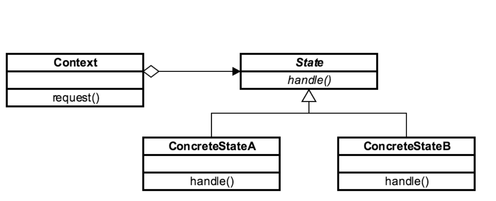
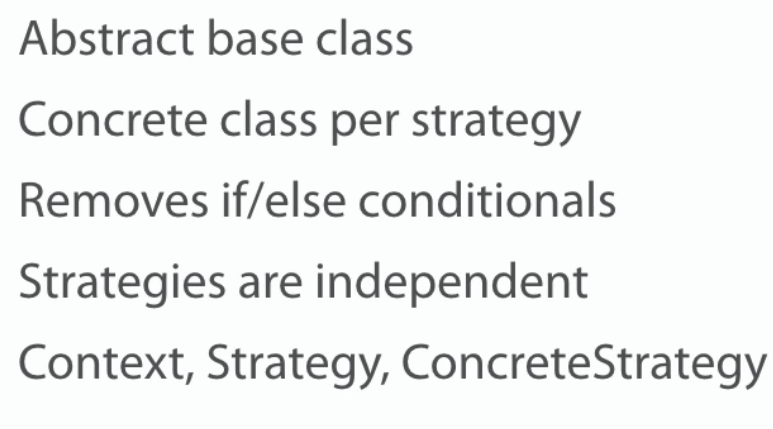
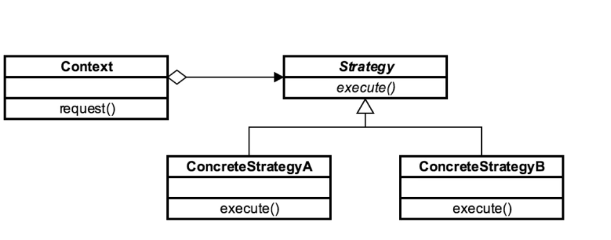
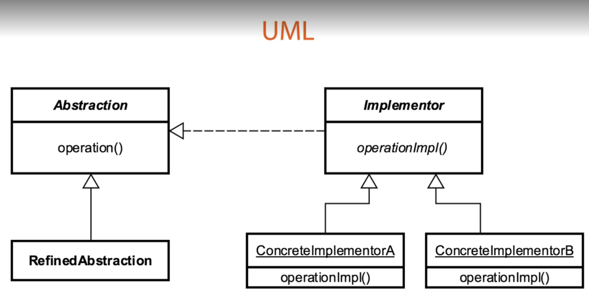

# Behavioral Patterns
Its about how objects interact with each other.

## State Pattern
Used when we need to represent a state in application

### Concepts
* Localize state behavior
* State object
* Separates what from where
* Open Closed Principle
* Examples: none , there is no a good example in java core api. some people says that iterator is a state pattern.

### Design
* Abstract class / interface
* Class based

### UML

### Pitfalls
* Simplifies cyclomatic complexity
* Adding additional states made easier
* More classes 
* Similar implementation to strategy

### Contrast
| Strategy   | State  |
|---|---|
| Interface based | Interface based  |
| Algorithms are independent  | Transitions  |
| Class per algorithm  | Class per state  |

### Summary
* Externalizes algorithms
* Client know different strategies
* Class per strategy
* Reduces conditional statements

## Stragety Pattern
Used when you enable the strategy or algorithm to be selected at runtime.

### Concepts
* Eliminate conditional statements
* Behavior encapsulated in classes
* Difficult to add new strategies
* Client aware of strategies
* Client chooses strategy
* Examples: Comparator => it enables client to choose proper stragety for its usage

### Design

### UML

### Pitfalls
* Client aware of strategies
* Increases number of classses

### Contrast
| Strategy   | State  |
|---|---|
| Interface based | Interface based  |
| Algorithms are independent  | Transitions  |
| Class per algorithm  | Class per state  |

### Summary
* Externalizes algorithms
* Client know different strategies
* Class per strategy
* Reduces conditional statements

# Structural Patterns
* Its about how you use or utilize objects.
* It could be something like performance or refactoring or memory utilization.

Structural Patterns are:
- Adapter
- Bridge
- Composite
- Decorator
- Facade
- Flyweight
- Proxy

## Adapter Pattern
Its a great pattern for connecting new code legacy code without having to change
the working contract that was produced from the legacy code originally.

### Concepts
* Convert interface into another interface
* Legacy
* Examples: Arrays to Lists

### Design

### Example

### Pitfalls
* Not a lot 
* Multiple adapters
* Do not add functionality consider using decorator patterns instead.

### Contrast
| Adapter   | Bridge  |
|---|---|
| Works after code is designed | Designed upfront  |
| Legacy  | Abstraction and implementation vary  |
| Retrofitted  | Built in advance  |
| Provides different interface  | Both adapt multiple systems   |

### Summary
* Simple solution
* Easy to implement
* Integrate with legacy
* Can provide multiple adapters

## Bridge Pattern
Very similar to Adapter pattern. Tha main difference is that bridge works with new code, whereas the adapter works with
legacy code.

### Concepts
* It decouples abstraction and implementation
* To do this use Encapsulation, composition, inheritance
* Changes in abstraction wont affect the client
* Details may not be right
* If you aren't quite sure of what the end product of what you're building will be, the bridge is great
for giving us flexibility without breaking things with change
* Examples => Driver, JDBC

### UML

### Example

### Pitfalls
* Increases complexity
* Conceptually difficult to plan

## Facade Pattern
Very similar to Adapter pattern. Tha main difference is that bridge works with new code, whereas the adapter works with
legacy code.

### Concepts
* Make an API easier to use
* Reduce dependencies on outside code
* Simplify the interface or client usage
* Usually a refactoring pattern
* Examples: java.net.URL

### UML

### Pitfalls
* Typically used to clean up code
* Should think about API design

### Contrast
| Facade   | Adapter  |
|---|---|
| Simplifies interface | Also a refactoring pattern  |
| Works with composites  | Modifies behavior  |
| Cleaner API  | Provides a different interface |

## Flyweight Pattern
Is a pattern that minimizes memory used by sharing data with similarly type objects.

### Concepts
* More efficient use of memory
* Large number of similar objects
* Immutable
* Most of the object states can be extrinsic
* Examples: java.lang.String and all other wrapper classes

### Design
* Patterns of patterns
* Utilizes a factory
* Encompasses creation and structure

### UML

### Pitfalls
* Complex pattern
* Must understand factory

### Contrast
| Flyweight   | Facade  |
|---|---|
| Memory optimization | Refactoring pattern  |
| Optimization pattern  | Simplified client  |
| Immutable objects  | Provides a different interface |

## Flyweight Pattern
Is a pattern that acts as a interface to something else

### Concepts
* Interface by wrapping
* Can add functionality
* Security, simplicity, remote
* Proxy called to access real object
* Examples: java.lang.reflect.Proxy, java.rmi.*

### UML

### Pitfalls
* Complex pattern
* Must understand factory

### Contrast
| Flyweight   | Facade  |
|---|---|
| Memory optimization | Refactoring pattern  |
| Optimization pattern  | Simplified client  |
| Immutable objects  | Provides a different interface |